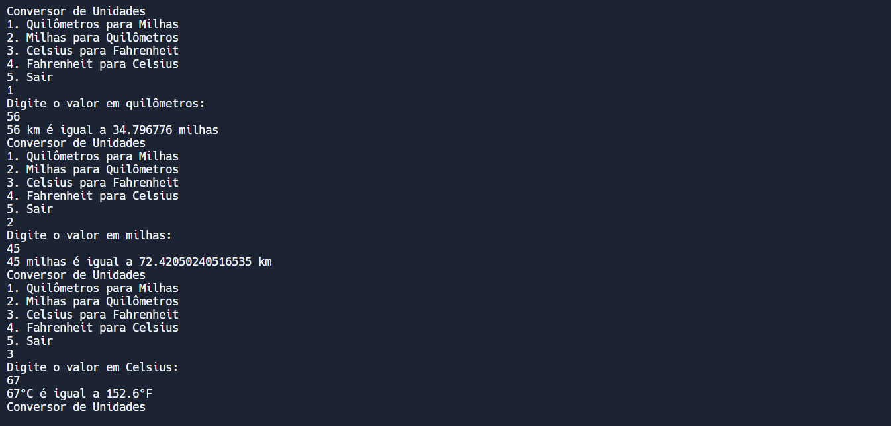
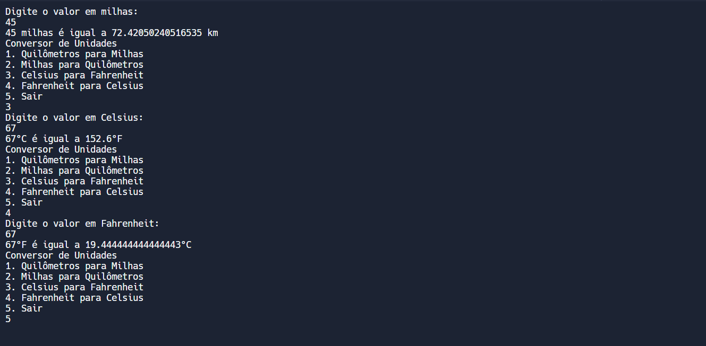

# CONVERSOR DE UNIDADES
👨‍🏫CONVERSÃO DE QUILÔMETROS PARA MILHAS, MILHAS PARA QUILÔMETROS, CELSIUS PARA FAHRENHEIT E FAHRENHEIT PARA CELSIUS COM RUST.

 <br>
 <br>

## DESCRIÇÃO:
Este projeto é um conversor de unidades de medida implementado em Rust. É uma aplicação de linha de comando que permite ao usuário converter entre diferentes unidades de distância e temperatura. As funcionalidades incluem a conversão de quilômetros para milhas, milhas para quilômetros, Celsius para Fahrenheit e Fahrenheit para Celsius.

## FUNCIONALIDADES:
1. **Conversão de Quilômetros para Milhas**:
   - Converte uma distância em quilômetros para milhas.
   - Fórmula utilizada: \( \text{milhas} = \text{quilômetros} \times 0.621371 \).

2. **Conversão de Milhas para Quilômetros**:
   - Converte uma distância em milhas para quilômetros.
   - Fórmula utilizada: \( \text{quilômetros} = \text{milhas} / 0.621371 \).

3. **Conversão de Celsius para Fahrenheit**:
   - Converte uma temperatura em graus Celsius para Fahrenheit.
   - Fórmula utilizada: \( \text{Fahrenheit} = \text{Celsius} \times \frac{9}{5} + 32 \).

4. **Conversão de Fahrenheit para Celsius**:
   - Converte uma temperatura em graus Fahrenheit para Celsius.
   - Fórmula utilizada: \( \text{Celsius} = (\text{Fahrenheit} - 32) \times \frac{5}{9} \).

5. **Opção de Sair**:
   - Permite ao usuário sair do programa.

## COMO USAR?
1. **Build do Projeto:**
   - Para compilar o aplicativo para produção, navegue até o Diretório `./CODIGO`, e digite o seguinte comando no Terminal:
     ```bash
     cargo build
     ```

2. **Execução do Projeto:**
   - Para iniciar o aplicativo, digite o seguinte comando no Terminal:
     ```bash
     cargo run
     ```

3. **Interagindo com Aplicativo:**
   1. **Executar o Programa**:
      - Ao iniciar o programa, o usuário será apresentado com um menu de opções.

   2. **Selecionar a Conversão Desejada**:
      - O usuário deve digitar o número correspondente à conversão desejada e pressionar Enter.

   3. **Inserir o Valor para Conversão**:
      - Após selecionar a opção, o programa pedirá ao usuário para inserir o valor a ser convertido.

   4. **Ver o Resultado**:
      - O programa calculará e exibirá o resultado da conversão.

   5. **Repetir ou Sair**:
      - O usuário pode escolher outra conversão ou optar por sair do programa.

## NÃO SABE?
- Entendemos que para manipular arquivos em muitas linguagens e tecnologias, é necessário possuir conhecimento nessas áreas. Para auxiliar nesse aprendizado, oferecemos cursos gratuitos disponíveis:
* [CURSO DE RUST](https://github.com/VILHALVA/CURSO-DE-RUST)
* [CONFIRA MAIS CURSOS](https://github.com/VILHALVA?tab=repositories&q=+topic:CURSO)

## CREDITOS:
- [PROJETO CRIADO PELO VILHALVA](https://github.com/VILHALVA)


